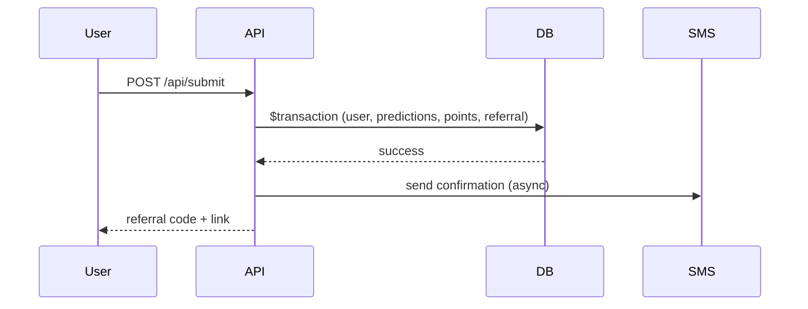

# Design — Initial MVP

## Architecture

Single Next.js App Router monolith. No separate backend server.

```
app/           → pages + API route handlers
components/    → public + admin UI
lib/           → domain logic (phone, points, sms, auth, matches)
prisma/        → schema, migrations, seed
```

## Key Decisions

### Admin Auth
HMAC-signed HttpOnly session cookie using `ADMIN_SESSION_SECRET`. Password from `ADMIN_PASSWORD` env var. No user table for admin in MVP.

### Match Availability
Server-side query: `startTime > now AND startTime <= now + 24h AND status IN (SCHEDULED, ACTIVE)`. Re-validated on every submit.

### Points
All values read from `PointRule` at transaction time. `pointsAwarded` snapshotted on `Prediction`. `PointTransaction` for every change.

### Submit Transaction
Single Prisma `$transaction`: user upsert, predictions create, base registration points, referral reward. SMS fires after commit.

### Settlement
Single `$transaction`: update match, score predictions, create transactions, update user points. Reject if `settledAt` already set.

### User Session (Leaderboard)
`wc_participant` cookie set on successful submit (referralCode). Leaderboard API returns `currentUser` rank when cookie present.

### Campaign Freeze
`CampaignSetting` keys: `CAMPAIGN_FROZEN`, `CAMPAIGN_FROZEN_AT`, `PRIZE_WINNER_USER_ID`. Submit API checks freeze before processing.

### Layout
Public: max-width 430px centered. Admin: full-width RTL panel.

## Data Flow


